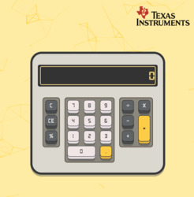

# React Calculator

If you  want to try it,  follow this link:

"LINK"

## Usage

You can use `mouse` and `keyboard` to perform operations

## Libraries

[**React**](https://github.com/facebook/create-react-app)

[**sass**](https://github.com/sass/dart-sass)- for sass in  react

[**Textfit**](https://github.com/malte-wessel/react-textfit) - for auto resize calculator display

[**tsParticles**](https://github.com/matteobruni/tsparticles) - for background particles

[**mathjs**](https://github.com/josdejong/mathjs) - for mathematical operations 

## Design idea 

Design was based on `Texas Instruments TI-5015`
